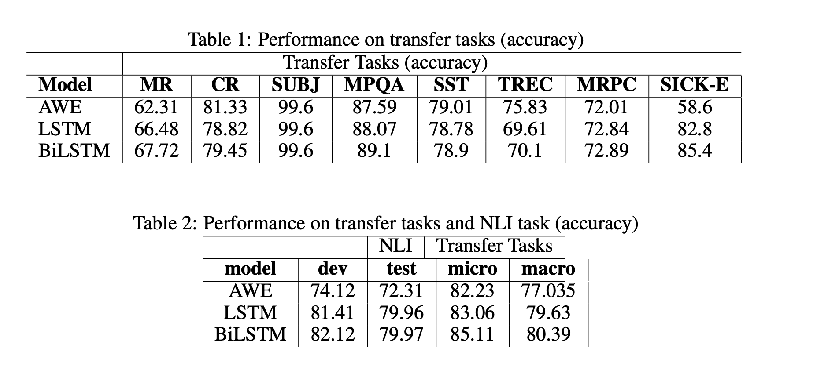
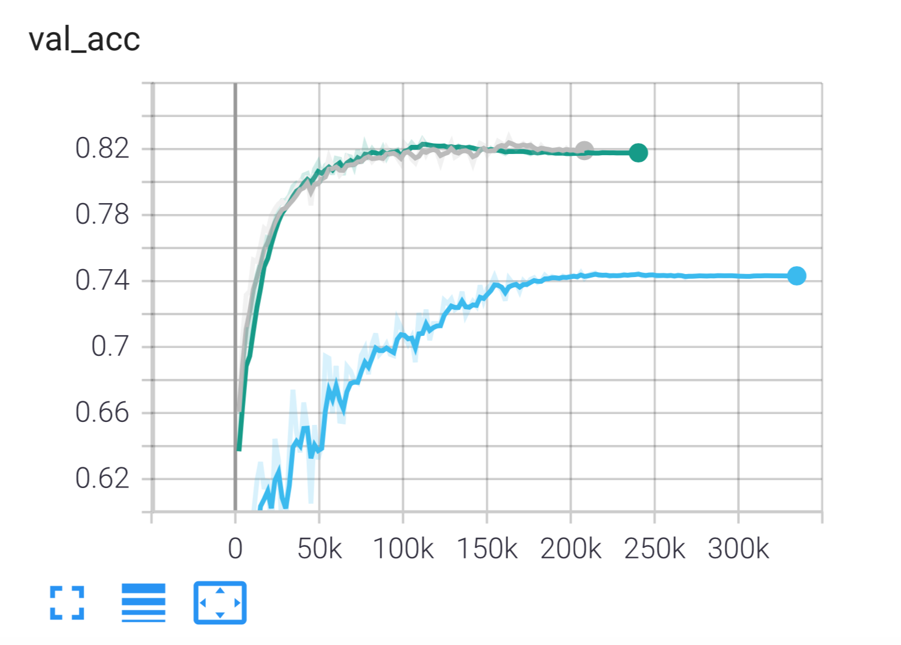
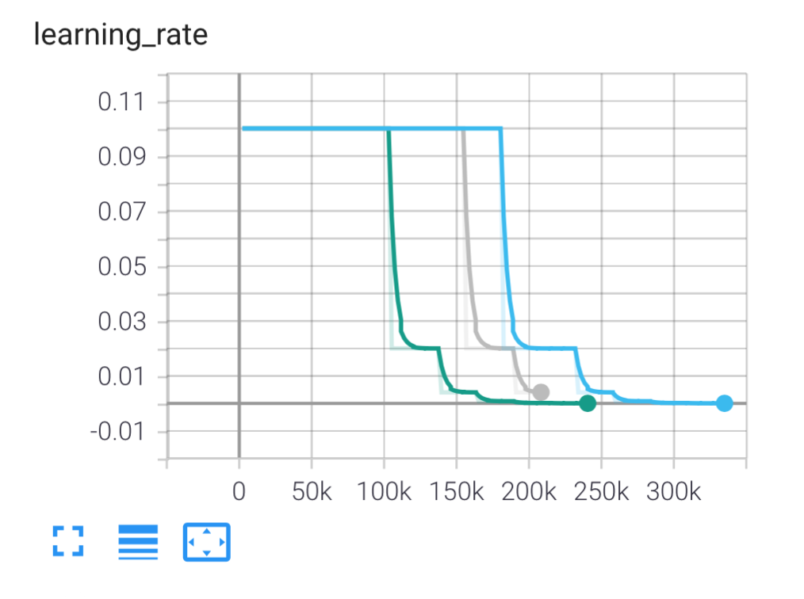

# Sentence-Representations-from-NLI

Repository for my implementation of assignment on sentence representations and Natural Language Inference (NLI) as a part of the Advanced Topics in Computational Semantics course at Univerisity of Amsterdam.

## Environment

- Create a conda environment with the latest version of python (3.9.1). E.g.  `conda create -n atcs-nli-representations python=3.9.1`.
- In the repo root folder activate environment `conda activate atcs-nli-representations` and install the requirements `pip install -r requirements.txt`.

## Data

- Install SentEval next to the current "repo" folder. Such that the most outer, [Sheverdin_ATCS_Project_1] folder would have 2 children folders -> ['repo', 'SentEval']. Please find  SentEval here: `https://github.com/facebookresearch/SentEval`
- Senteval requires the necessary data so please follow the official SentEval data download instructions in   `SentEval` folder.
- Assignment is based on GloVe vector embeddings and they should be located in the following directions `SentEval/pretrained/glove.840B.300d.txt`  together with the one in the current folder's `dataset` for  cluster-based runs `repo/dataset/GloVe/glove.840B.300d.txt`
- The project also requires `SNLI` dataset that should be placed in `data/snli/snli_1.0` 
- To download the log folders, images etc. please follow the link 
`https://drive.google.com/drive/folders/1kXfP4RuKkOY9bwfzsfVGu70Inm74h6nG?usp=sharing` 

## Running experiments

- to run training for AWE only please run for example:
`python main.py --tokenize True`

- for training of recurrent models (LSTM,BiLSTM)  run
`python main_recurrent.py --tokenize True`

- Since vocabulary building takes time, you can run evalutations in `eval.ipynb` without having to rebuild the text fields

## Results

Models are estimated on the set of transfer tasks in terms of accuracy

Learning curves and adaptive learning rates:

  

